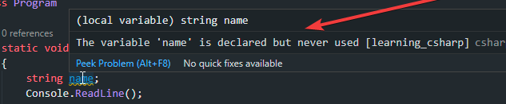
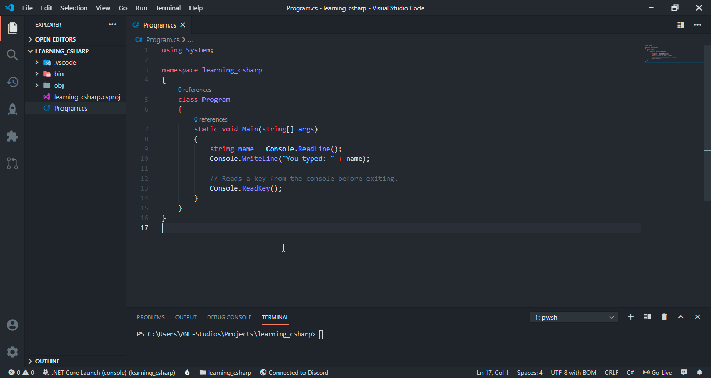
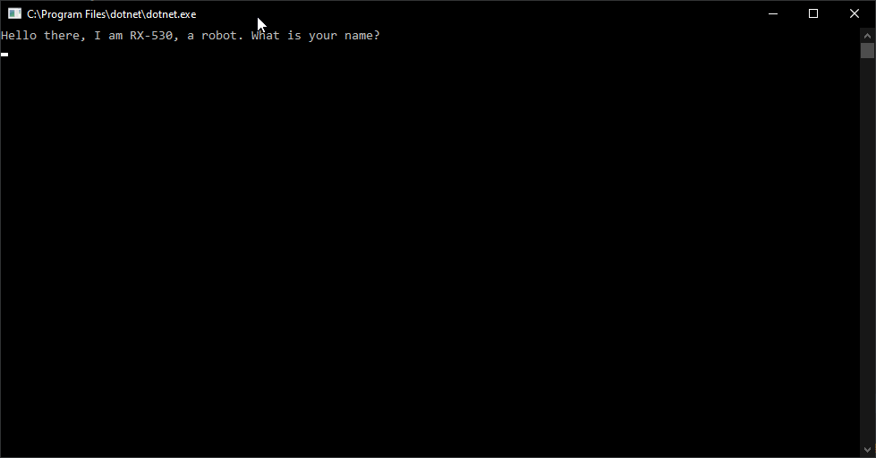

<!--more-->

Oh hello there!

If you're here and this is your first time/series here, I would recommend taking a look at the first series where I introduced you to programming and C#, we also got everything set up and ran our first hello world program. If you have gone through that, you don't really need to read it, but I'd still recommend that.

And if you are coming from that article, congrats if you learnt something new.. If you got stuck, feel free to ask for help at my discord server: [discord/ANF-Studios](https://discord.gg/fKWpK7A) - there are a ton of programmers that have experience in programming so they should be really helpful.

Anyhow, let's get started!

## About C#

This introduction may get boring, especially if you're a beginner. Feel free to skip this part!


C# really helps out to create robust and durable applications. This is all thanks to Microsoft. Speaking of Microsoft, they are the ones who are developing C# based on dotNET, which is what we installed in the previous post.

A quick note this part is not really necessary to read but it's interesting information:

When Sun introduced Java in 1995, Microsoft saw the potential in the language and its ecosystem and attempted to implement that strategy. It introduced its own implementation of the JVM with IE3 and then started enhancing it beyond the Java standard. Sun sued Microsoft in October 1997 for incompletely implementing the Java 1.1 standard, which forced Microsoft to eventually discontinue its implementation.

Rather than switching to Sun’s JVM, and thus giving Sun significant leverage in the Windows world, Microsoft decided to "out Sun" Sun, by introducing their own language and platform, and effectively killing Java on Windows. They brought renowned programming languages designer Anders Hejlsberg on board, who already had experience mutating and improving existing programming languages, and gave him the task to create a "better Java" (not officially, but in practice). Thus C# and the .NET framework were born.

### Why I love C#
C# is a great language. I personally really like it, I hope you do too. The reason for that is that Microsoft has put a lot of effort into it and it works well. The ecosystem and ease to use C# itself have convinced me to use C# over another language.

There's even an amazing and powerful package manager not only for C# but for the entire .NET ecosystem and its languages (yes, there are other languages based on dotNET), called [nuget](https://nuget.org).

We might even write a library and possibly publish it there, no promises though :eyes:

Moreover, the standard library (a set of functions provided by C# developers) is so so well built, I, myself am impressed.

### How C# works
Finally, I wanted to talk about how C# works. Programming languages are a way to express, not to the computer or the compiler, but to another person, what it is supposed to do. I think of programming as a way of art to express yourself.

There are different kinds of languages, there are tonnes of languages that offer unique features. For example, C++ is not a managed language, but hol', what even is a managed language?

That is what I am going to explain to you right now; programming languages are powerful, there are low-level languages, and there are high-level languages. Previously, we discussed how C# is a modern language which makes it high level. And low-level languages where you have a bit more boilerplate code. But you're probably asking; why do these even exist? Well, simple: Because they offer memory control and are generally faster, by which I mean they operate code quicker which is vital for applications that need those.

But wait a minute? Doesn't that mean C# gets slow and heavy? Well.. not exactly. It depends on the application itself and the code that is running behind the scenes. C# isn't really slow, I am satisfied with it.

#### The architecture of dotNET
Now, before we move on to trying out C#, I wanted to talk a bit about how .NET works or is built.

You've only really been hearing about .NET used to run and built C# code so far, so I wanted to clear this out to you. What is dotNET? dotNET is a "[virtual execution system](https://en.wikipedia.org/wiki/Virtual_Execution_System)" which means that dotNET provides an environment for executing "[managed code](https://en.wikipedia.org/wiki/Managed_code)". It also provides data types that are built into it such as some of them that we're going to explore later on.

Other than that, it's called the "Common Language Runtime" which provides also provides built-in libraries, including some functions that we've used earlier (recall `Console.WriteLine` and `Console.ReadKey`).

So *C# only runs on dotNET, but what does it "compile to"?* Well binary, right? Well yes, but actually no, it compiles *into* IL (Intermediate language) form which at the end goes to binary. IL is really just a product of the compilation of code written in high-level .NET languages.

Now I don't want to make this too complex or get into too much detail, so I'll wrap this up here:

| About         | Info                      |
| ------------- | ------------------------- |
| Language      | C#                        |
| Runs on       | dotNET                    |
| Compiled to   | IL                        |
| Language Type | Managed/Garbage collected |
| dotNET is     | Virtual execution system  |

## Exploring C#

I think I've talked a lot about that and you're probably bored if you've read that, but don't you worry. Onto the fun parts!

### Variables

Firstly, I wanted to discuss with you from a general point of view, what a programming language should contain, let's see.. data/values? colors? green stuff?

Well, it does have that, sort of. Let's start with the most basic item; values.

"Values" is just a term I used for ease to give you an idea of what they are. The proper term for those are "variables" and that's what you should be using.

So variables can be really simple and really complex. They are one of the most basic parts of your program.

This is our initial code:

```cs
using System;

namespace learning_csharp
{
    class Program
    {
        static void Main(string[] args)
        {
            // Reads a key from the console before exiting.
            Console.ReadKey();
        }
    }
}
```

Let's suppose that we wanted to make a game that runs on our console. Firstly, we would want to store the name of the user so that we can use it later, right? So to store some text that we read from the console, there is a data type called `string`. Let's jump in and take a look at how can we "declare" a string and use it.

```cs
using System;

namespace learning_csharp
{
    class Program
    {
        static void Main(string[] args)
        {
            string name; // Variable declaration.

            // Reads a key from the console before exiting.
            Console.ReadKey();
        }
    }
}
```

Congratulations! You've made your very first variable. Let's see that specific part: `string name;`. "string name;", hmm... what does that mean? Well, a string is the data type we declare our variable in and "name" is the name of our variable. You can name it *almost* anything you'd like to, but I'll keep it whatever it is.

#### Using variables

So how do we use this variable? Is there some way to read a sentence instead of a character from the console? Of course, there is! As mentioned earlier, I love C# for its incredible library and feature support. The syntax for that is `Console.ReadLine();`.

This is how it goes:
```cs
using System;

namespace learning_csharp
{
    class Program
    {
        static void Main(string[] args)
        {
            string name; // Variable declaration.
            Console.ReadLine();

            // Reads a key from the console before exiting.
            Console.ReadKey();
        }
    }
}
```

And now, when we run our program, the only thing that would happen is that it would read a sentence until we press `Enter` and then read a key to finally exit.

But hey.. we haven't discussed this yellow warning. Why does it say that?



First of all, I want to point out that this variable is unused, but it allocates memory (RAM) unnecessarily. We are going to use the variable later on, so we can ignore that for now and will use our string later on.

<!-- Well, first of all, I want to point out that this variable is unused which allocates memory (writes to our RAM) unnecessarily, it wants to help us write better code but that warning is nothing to be worried about because we’re going to use it later on. -->

Another thing is that a lot of people don't read the error and just "freak out" as if it would never get solved. A simple trick to solve almost any error is to
1. Read what the error says and understand what it means.
2. Google (or whatever search engine you prefer to use) up that error and find sources on what it means.
3. Try to understand what it means rather than how to fix it.

Anyhow, we need to somehow bind the name variable to `Console.ReadLine();`. We do so by "assigning" variables.

In this case, we'll do it like so: `string name = Console.ReadLine();`. It's simple, isn't it? What this does is that it reads a line from the console and assigns that value to our name variable. This means that it gets our input from the console and gives it to this "name" variable. So whatever the user inputs will be stored in that variable.

Now, if we want to print this, we'll simply just put in `name` inside of the arguments our `Console.WriteLine();` takes. Like so: `Console.WriteLine(name);`, but for readability, I'll also add another string that tells us what we wrote.

We can just write two Console.WriteLines (or a `Console.Write` which is the same as `Console.WriteLine` except it doesn't append a new line at the end of printing), but the problem with that is we're printing two times due to which that method gets called* twice. That's not the best way to write code.


Like our "Main" method, which is called <!-- by dotNET --> when our code starts, the `Console.WriteLine` method that is part of dotNET (and not C#) gets called, which means we invoke it or run it. We'll look into methods in a future tutorial.


So, what we can do is "concatenate" strings together. There are multiple ways to do this that we will be exploring together. For this one, we'll use the `+` symbol like so: `Console.WriteLine("You typed: " + name);`. Let's see how that works out:



Great! We've learned something new.

## Understanding what everything means

Now, as the title suggests, we're also going to be looking at other parts of our code that we haven't explored. Let's bring out the code:

```cs
using System;

namespace learning_csharp
{
    class Program
    {
        static void Main(string[] args)
        {
            string name = Console.ReadLine();
            Console.WriteLine("You typed: " + name);
            
            // Reads a key from the console before exiting.
            Console.ReadKey();
        }
    }
}
```

Now `using System;`, what is this and what does it mean? This is called a "using directive" which allows us to qualify a use for a namespace. That allows us to use everything within that namespace, like the one we've declared called "learning_csharp". If we wouldn't have written that, we would get compile errors. Try and see it for yourself!

We would have to directly type out `System.Console.WriteLine(...);` and `System.Console.ReadKey();`. Other than that, we can also set "aliases" that change how we use a specific namespace. Here's a sample:

```cs
using std = System; // std means "standard" library.

namespace learning_csharp
{
    class Program
    {
        static void Main(string[] args)
        {
            string name = std.Console.ReadLine();
            std.Console.WriteLine("You typed: " + name);
            
            // Reads a key from the console before exiting.
            std.Console.ReadKey();
        }
    }
}
```

You're probably wondering what the benefit of this is, well, there's this thing called nested namespaces which we'll look into in the future.

Now "class", what is that? Is that what a lecture you take in a school? Well, not quite. You can think of a class as a "type", such as the one we used called "string" except it's a bit different. Classes are, by definition a "reference type" (which stores a reference, we'll look more into "value types" and "reference types" in the future). `Console` itself is a class. Think of it as a container of methods and variables etc. We'll look more into those in the future.

I know I'm saying that a lot that "we'll be looking more into that in the future" and not explaining a lot because it really gets super complex.

## Variable types

Now I think we should have a glance and the basic types.

Starting with `int`. Well, what is int? If you can guess, it means integer. You cannot have a floating-point value as an integer which means a decimal point value such as `1.1146`. Only whole numbers are valid. You can perhaps store someone's age using Console.ReadLine? You can store how many days does it take for the Earth to complete an orbit around the Sun and much, much more. Now a number takes memory to store right? An int type takes 4 bytes of memory in C#, which means the maximum number you can have is `2,147,483,647` which is a lot.

```cs
// Declaration example.
int variable = 0;
```

Now the second type is a string which we have already used earlier. You can already guess what it's used for. It's a Read-Only collection of another data type called `char` and it can also take upto 4 bytes of memory which is a lot of characters.

```cs
// Declaration example.
string variable = "Hello World!";
```

Char is a type that can only take in one character. The interesting thing about them is that they can be declared with both single and double quotes like `''` and `""`.

```cs
// Declaration example.
char variable = "a";
char anotherVariable = 'b';
```

If you put more than just one character in there, you'll get a compile error and it won't work, so don't do that.


Another thing I wanted to share that I found out while researching this (I keep double/triple checking sources to check I don't spread misinformation) is that you can make a string out of an array of chars. Now an array is declared with two square brackets right after the type like so: `type[]`. We will be discussing that later on.

So this is how you can make a string from a char array:
```cs
char[] myCharArray = { 'a', 'b', 'c' };
string myString = new string(myCharArray);
```

Now, this has a lot in it, a lot, and I can understand that. But you don't need to worry about this for now.


There are a lot more types than this, but I think these will be enough. In the future, we *might* also create our own type.

Today's challenge is going to be a little bit tricky which involves a bit more complex code than we have right now, so I'll give you some tips:

First of all, when you want to read a specific key, but also know what it is, the easiest way to do so is using the `Console.Read();` method. It returns an integer type which is the "index" of the key code. This index is based on the ASCII table which is shown in the following image:


Great! We can store that in a variable like we did when using `Console.ReadLine();` except that since it returns an int, we will store it in an int, like so:

```cs
int key = Console.Read();
```

But the problem is that we don't know how to determine which key it is, when we use or print it to the console, we will get a number. So, to *convert* it into a form of text (either string or char), we can "cast" it. There are two ways of casting, we'll be using "explicit" casting which will go like this:

```cs
int key = Convert.ToChar(Console.Read());
```

But we'll get an error, this is because we're making it into a character, although the variable we're storing is an integer, which is wrong because as stated earlier, both have a different size and definition.

So, we can simply change that `int` to `char` i.e, `char key = Convert.ToChar(Console.Read());`.

Similarly, you can also change it to `Convert.ToString` (note that you would also have to change the type). For a normal integer i.e, `int`, you can use `Convert.ToInt32` which represents a 32-bit integer. We'll be looking at different types of numbers in the future. 

## Wrapping up

I think that's enough for today, we have learned a lot.

Now for today's challenge:

Your goal is to make a program, a chatbot doesn't need to be good, just a simple chatbot that asks some questions and talks for a bit. You can make it however you like.

This is how it should look:



Now, as this is a challenge for you, you're going to have to do it without copying code. I will leave a solution/sample if you ever get stuck. Don't worry though, you only require more practice.

I'll be using [PasteMyst](https://paste.myst.rs) to store the solutions, pastemyst is a code-sharing site that I would recommend that you should use.
Here's the paste: [pastemyst/y1ze5xfl](https://paste.myst.rs/y1ze5xfl).
