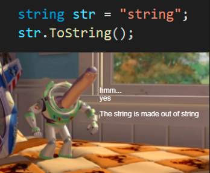

<!--more-->

Strings. What are they and how do we use them? Are strings a thread of cotton in our code? They seem very powerful and we have used them a lot. We'll be looking at how they can be used today.


Hey there, if you haven't read the [previous article](/blog/csharp/overview), I recommend skimming over it, we looked through basic types and a bit on C# and dotNET itself.


## What are strings
So let's start simple. "What are strings?" A string is an "object" of type String whose value is text. Now, you might be confused on "String", well for now, just know that "String" is a class (just like the one we have in our program, but slightly different).

Internally, the text is stored as a sequential read-only collection of Char objects. As you would've guessed, there is another class like String called Char.

Fun fact! You can also declare a string or a char like:
```cs
String variable = "...";
Char variable = '.';
```

Keep note that you cannot directly do that, you will have to include the `using System;` part. Speaking of which, System is a namespace, just like our `learning_csharp` namespace declaration. Finally, these are valid because **s**tring and **c**har are literal aliases to System.**S**tring and System.**C**har.

But that was just for your information.

### Null Character
Now, another thing that is important for you to know is `0` - no, not the literal character/number, but rather the "null character". Generally, for strings, it tells our computer (since code does run on a CPU) that this is the point where the string finishes. However, in C#, this is just an empty character and the string does continue.





Now, since I am here not just to teach C#, but programming itself as well, I shall be giving examples from other languages. This is some C++ code:
```cpp
std::string str = "Hello Wo\0rld!";
```

Notice that there's a null character. The output of a program that prints that variable will be `Hello Wo`. That's because our variable ended, *apparently*.

Now, in C#, it'll be... empty. *Like* a space character, but not exactly.
```cs
string str = "Hello Wo\0rld!";
```

This program will output: `Hello Wo rld!`. Crazy, right? But that's how it works and as far as it goes to the design choice, I do believe this is the right thing as C# is a managed, high-level language.

Just a quick note that I used a space there and a space character is not a null character!

### Convert other data types to a string
String is a very commonly used and interchanging data types can be really useful. In the previous blog, we used the `Convert.ToString` method which was really useful. But that was a quick overview, we'll be looking into that in greater detail.

Now, since C# is a strongly typed language, we can't "automatically" change the type. This isn't JavaScript.


and if you do something like:
```cs
int i;

// error CS0029: Cannot implicitly convert type 'string' to 'int'
i = "Hello";
```

You'll get an error! As the error suggests, we have this number (int, data type), and we are assigning it a value, and that value is some text (string, data type), which is not what the data type is for, hence the error... Moving on.


That's because a data type tells the computer how much memory to allocate, as in, how much size does something take. For example, a `char` takes 2 bytes of memory and a `string` takes 4 bytes of memory. Moreover, this also helps the developer/programmer write better code, with more object oriented programming.


#### Implicit vs Explicit
So we know how to convert another data type to a string, but there are other ways as well. But before we look into those, we should know that there are four types of type-conversion. But we're not going to discuss all of them -- I just let you know for your information -- rather just two most basic and essential ones that you'd be using most of the time; implicit type-conversion and explicit type-conversion. I will discuss all of them some time in the future though.

Sarting of with implicit; it has no special syntax required because the conversion always succeeds and no data will be lost.

For example, conversion of int to char can be done implicitly. But you may ask, how does it convert a character to a number, right? Well, simple! It follows the ASCII table.

Here is an example:
```cs
char c = 'A';
int i = c;
Console.WriteLine(i);
// Output: 65
// That's ASCII for 'A'.
```

Try running this code to see the output for yourself!

As it goes to explicit conversion; conversions require a cast expression. Casting is required when information might be lost in the conversion, or when the conversion might not succeed for other reasons.

Let's just say, this char. We don't want to make a variable and then convert it, we just want to directory do it within the integer variable itself, how do we do that, is it possible? If you try `int i = 'A'`, that won't work! Implicit isn't doing its job, this is where explicit conversion comes in:

```cs
int i = (int)'A';
Console.WriteLine(i);
```

And that works flawlessly. Both implicit and explicit conversions apply to other data types as well, however, I don't want to go off topic, I will explain this in detail in a future article.

##### Other ways of conversion
But conversion methods didn't end there, there are two other major methods of conversion.

One, is `Convert.ToString`, which we have used before:
```cs
Convert.ToString("You are awesome!");
Convert.ToString(42);
```

And the other, is `foobar.ToString()`, where `foobar` is any variable.

For example:

```cs
myString.ToString();
42.ToString();
```

This calls for a meme!



There is also one more way, which is not commonly used, I have never used it at least:
```cs
string str = "some string" as string;
```

But don't worry about this, it's not important for the time being, but we will use it a lot later on.

