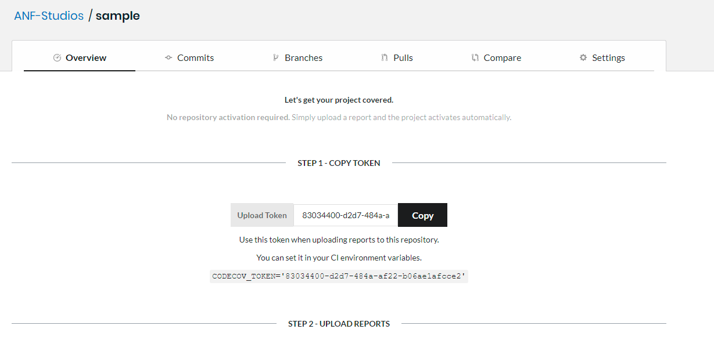
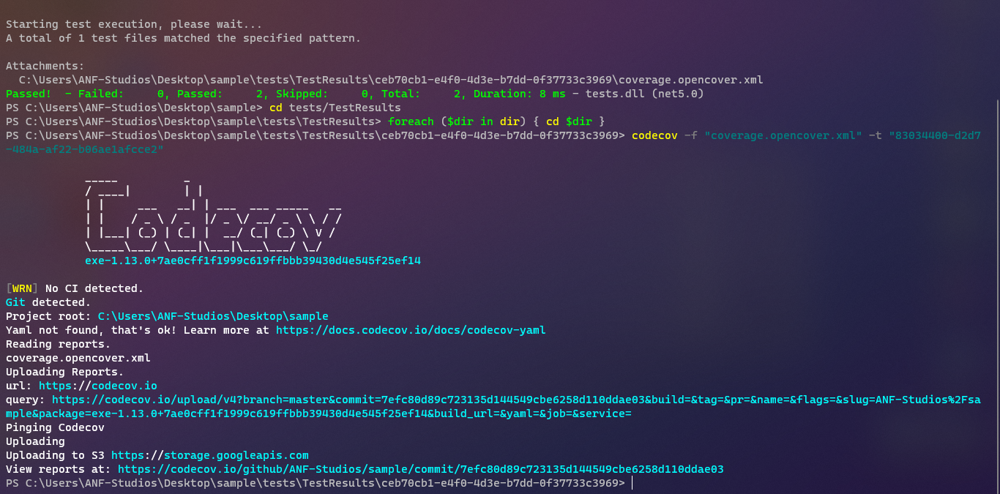
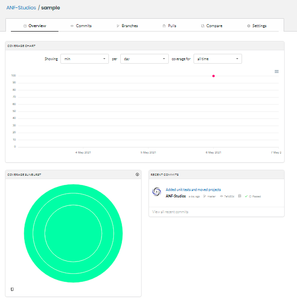
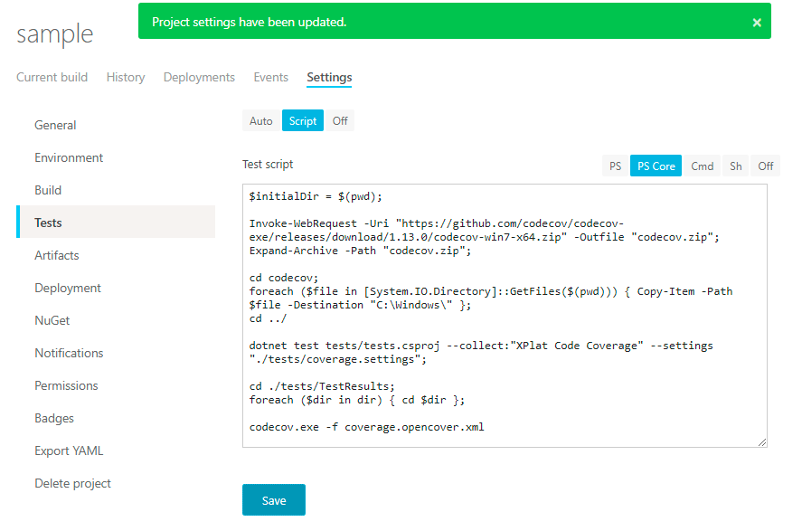

<!--more-->

As a newbie or experienced programmer, you might have faced some issues when setting up [CodeCov](https://codecov.io), because I know I did. Being aware of how hard it can be, but still being able to do so (because I love DevOps personally) despite of that is great, but I'm also going to share how I did so!


If you're wondering if you can see my configuration, check out one of my projects; [WinPath](https://github.com/ANF-Studios/WinPath) -- people found it helpful as it's super simple. Don't forget to star it if it's helpful for you too :wink:. 


Before we start, keep note that my project uses:
| Property          | Value                                                            |
| ----------------- | ---------------------------------------------------------------- |
| Language          | C#                                                               |
| Version control   | GitHub*                                                          |
| CI                | AppVeyor*                                                        |
| Testing framework | xUnit**                                                          |
| *                 | This is what I'll use, however, it doesn't *specifically* matter |
| **                | You can use any                                                  |

Now let's get started!

## Setting up CodeCov

Considering you have a CodeCov account, visit codecov.io/<version control\>/<username\>/ -- in my case; https://codecov.io/github/ANF-Studios/ -- and once there, create add/import a new repository:


Alternaitvely, you can directly visit codecov.io/<version control\>/<username\>/<repository\>.

Once there, you should see something like this:



Keep note you might need to activate the repository in its settings if necessary. You should also notice your token, you don't really need it if your repository is public and your CI is any of Travis, CircleCI, AppVeyor, Azure Pipelines or GitHub Actions, otherwise, you do.

## Sending reports to CodeCov

Perfect! We now have added our project to CodeCov, now, we need to set up AppVeyor. I trust that you already have a CI, so we'll skip the adding a codecov project part. Oh and, it usually doesn't matter what CI you use.

But before we jump into the CI directly, let's generate those reports on our local computers so that we can get to see the results for ourselves. So first and foremost, we run our tests, *but*, we also need to tell .NET to generate an XML report, to do so, we'll be using [XPlat Code Coverage](https://github.com/coverlet-coverage/coverlet/blob/master/Documentation/VSTestIntegration.md) which will help us generate code coverage reports. For that, we'll use this as our coverage collector:
```ps1
> dotnet.exe test --collect:"XPlat Code Coverage"
```

### Coverage settings

On running this, you'll notice an xml file has been generated in `Project_Root/TestsFolder/TestResults/Some GUID/coverage.cobertura.xml`. And codecov does require an xml file, however, this is not the format of the xml CodeCov expects from us. *CodeCov uses OpenCover.* Hence you require coverlet.console to be installed (citation needed). You can run `dotnet tool install coverlet.console --global`.


From my runs, I tried uninstalling coverlet.console and then running it, it worked just fine and nothing went wrong, however, there is no real evidence that backs this up other than the fact that it's a console application. You do not need to install it, however, if .NET throws an error, you can go ahead and install that.


We'll need to tell our test command to generate a report for CodeCov, we can do so by creating a coverage settings file, usually called `coverage.runsettings`, but I personally like to name it `codecov.settings` or `coverage.settings`. But how does it look like?

It's in an xml format and this is the bare bones you'll be needing:
```xml
<?xml version="1.0" encoding="utf-8" ?>
<RunSettings>
  <DataCollectionRunSettings>
    <DataCollectors>
      <DataCollector friendlyName="XPlat code coverage">
        <Configuration>
          <Format>opencover</Format>
        </Configuration>
      </DataCollector>
    </DataCollectors>
  </DataCollectionRunSettings>
</RunSettings>
```

See [Coverlet's documentation](https://github.com/coverlet-coverage/coverlet/blob/master/Documentation/VSTestIntegration.md) for more information.

### Generating reports

I like to store this `runsettings` file in the tests directory, but you don't need to do the same. Once the file is there, you can run
```ps1
> dotnet.exe test --collect:"XPlat Code Coverage" --settings "./path/to/coverage.settings"
```

And voila! You have generated your report. Granted that you have unit tests covered, you shouldn't have any errors when sending your report to codecov.

By far, the easiest way to send your report to CodeCov is using [their console](https://github.com/codecov/codecov-exe/releases/latest). You can run
```ps1
> codecov.exe --file "path/to/file" # --token "..." # Uncomment the token part if you aren't using a CI like AppVeyor, GitHub Actions, Circle CI, Travis, etc. 
```

But there's a catch here, the cli will detect your project root and set its working directory there and that there's a guid folder randomly generated so it's hard to get that directory, there are multiple workarounds for it.

If you're on Linux, bash; you can do something like `foo/**.xml` and get that file, but I'm not much of a Linux person. *However*, if you're using PowerShell (Core), you can enumerate into it:
```ps1
cd testsfolder/TestResults/;
foreach ($dir in dir)
{
    cd $dir # Since in your CI, there's only one directory for one test, you can cd into that.
    # Optionally also send the report directly if you have more than one test result.
}
```

For command prompt:
```cmd
for /d %%A in (*) do cd %%A
```

## Final result

And now if we send our report:


And now, if we check, our code coverage is reported:



It's there and every statistic is there! And that leads us to our conclusion! But since this article is about sending reports using AppVeyor, we shall write a small script to do so, but first, don't forget to push your settings!



```yml
image: Visual Studio 2019

before_build:
- pwsh: dotnet restore
build:
  verbosity: minimal
test_script:
- ps: >-
    $initialDir = $(pwd);

    Invoke-WebRequest -Uri "https://github.com/codecov/codecov-exe/releases/download/1.13.0/codecov-win7-x64.zip" -Outfile "codecov.zip";

    Expand-Archive -Path "codecov.zip";

    cd codecov;

    foreach ($file in [System.IO.Directory]::GetFiles($(pwd))) { Copy-Item -Path $file -Destination "C:\Windows\" };

    cd ../
    
    dotnet test tests/tests.csproj --collect:"XPlat Code Coverage" --settings "./tests/coverage.settings";

    cd ./tests/TestResults;

    foreach ($dir in dir) { cd $dir };

    codecov.exe -f coverage.opencover.xml
```

This is the yml file if you're interested. You can modify it for your needs. That said, this brings us to our conclusion, I hope you found this helpful!
